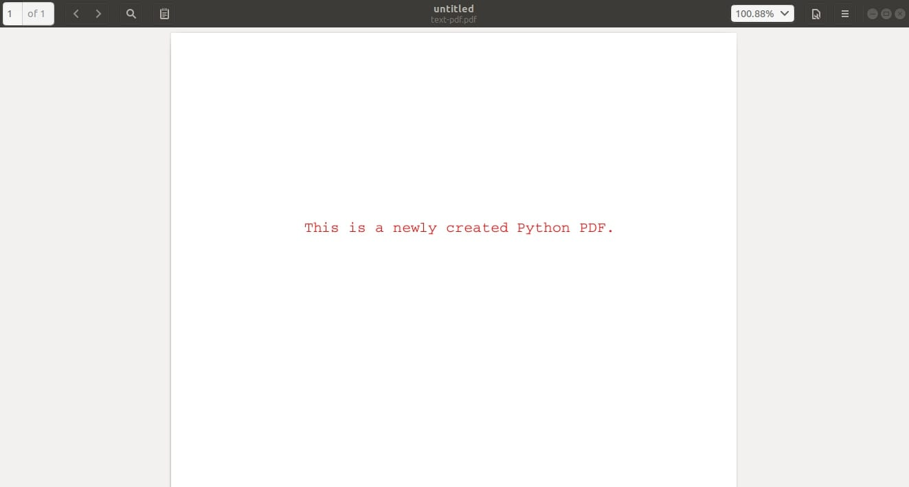
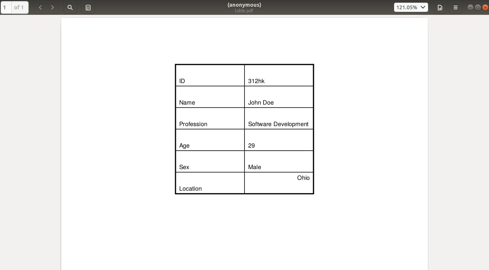
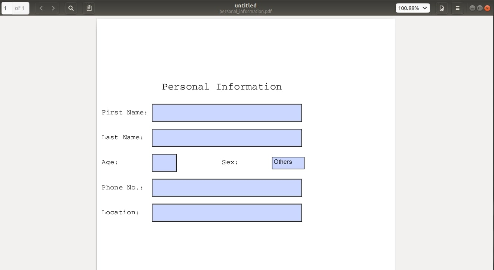
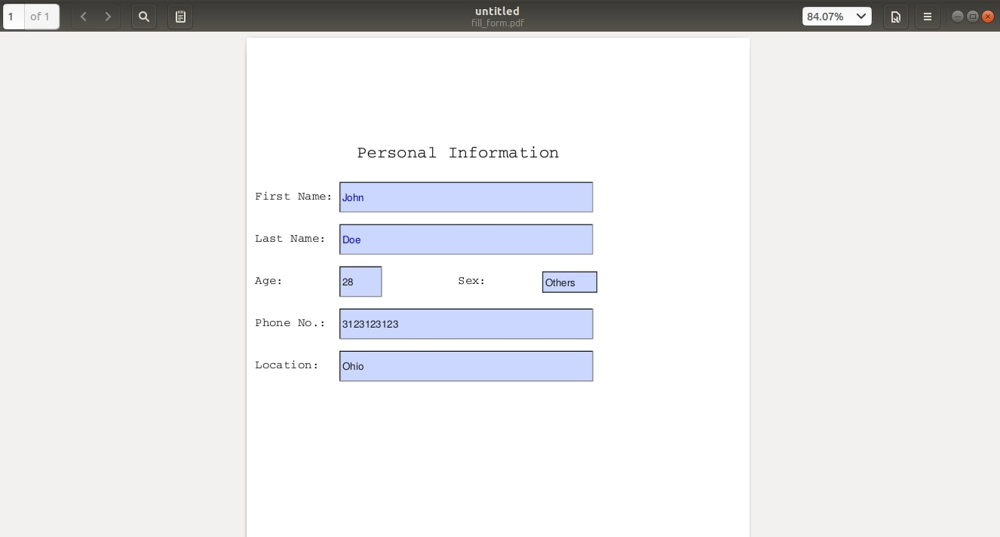
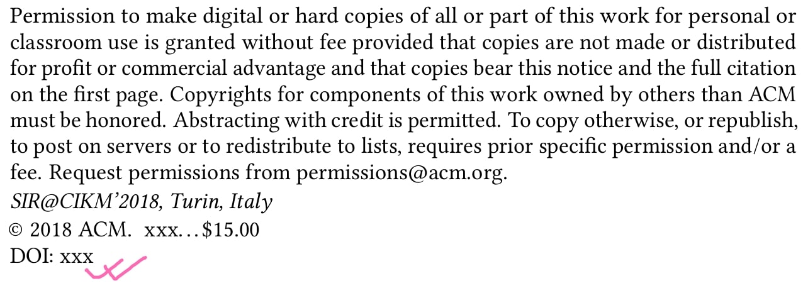
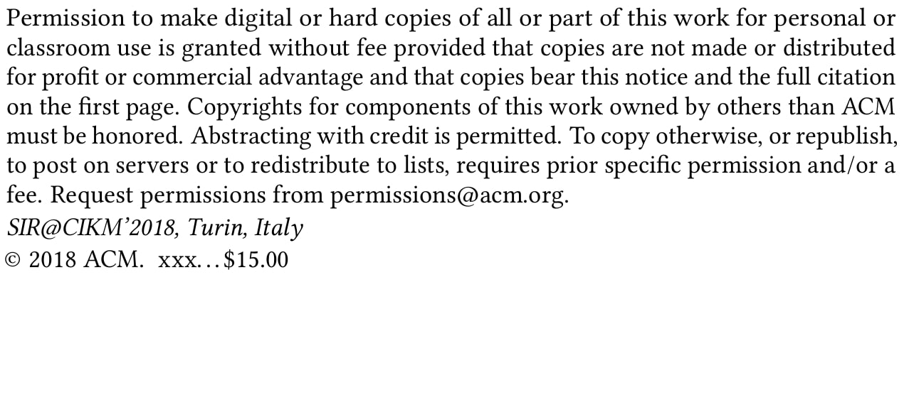
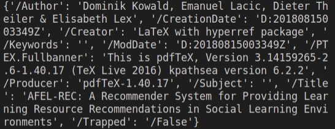
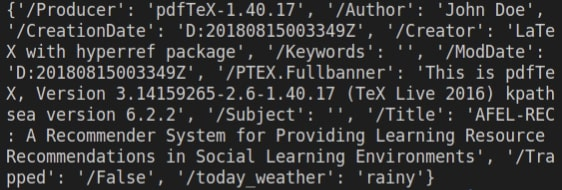

# Python PDF Handling Tutorial

Python is a highly versatile language with a huge set of libraries. It is a high level language with simple syntax. Python has a reach in various fields like Machine Learning, Cybersecurity, Web Development, Application Development etc. Thus, this language is mostly preferred among developers and engineers.

In this tutorial, we will be working on PDFs using Python. PDFs or the Portable Document Format is a file format of a document consisting of texts, images, tables, etc which are generally used when we need to save files that cannot be further modified or be easily shared or printed. This file format was developed by Adobe in 1993 to present documents, including formatted texts and images in a manner that is independent of applications, software, hardware and operating systems.

Here, we will be performing some serious stuff like: Extracting and Adding Pages, Texts, Images, Tables, Watermark and much more on a PDF file using Python.

## Popular Python PDF Libraries

Python provides a pool of libraries that are used to manipulate a PDF file. Some popular libraries that are used oftenly while working with PDFs are:

- PDFMiner
- PyPDF4
- PyPDF2
- Python-Docx
- PyMuPDF, etc.

While there are several libraries that are used to perform various functional operations with PDFs in Python, we will only cover the usage of a few libraries like PDFMiner, PyPDF2, PyMuPDF, reportlab etc in this chapter. PyPDF2 is the most widely preferred Python module while working with PDFs. It is easy to use and it has a lot of features. However, when it comes to extracting texts, PDFMiner is much more accurate and reliable. PDFMiner was specially developed to extract texts from PDF files. There are several cases where one library is better than other in different aspects when it comes to manipulating the PDF files. Thus, on the basis of easiness and reliability, we will discuss various libraries that are used to manipulate PDF files in this tutorial.

## Extracting Texts from PDFs

PDFs are composed of different contents like: Texts, Images, Tables, Forms, etc. PDFs are the graphical representations of information. They provide information on the exact position of a display or a paper. But, they do not have a logical structure specified for sentences or paragraphs and cannot adapt themselves when the size of display changes. PDFMiner does the work for us by analyzing the layouts and guessing the position of texts and other contents.

When it comes to extracting texts from PDFs, PDFMiner is considered to be the most robust library used to perform the text extraction operation. Thus, in this section we will demonstrate the usage of PDFMiner for Text Extraction.

First, we have to install PDFMiner.

### Installing PDFMiner

You can install PDFMiner by running the following command.

```shell
>>> pip install "pdfminer.six==20200124"
```

Here, we are specifying the particular version of PDFMiner after "==". Some versions might raise incompatibility errors with Python thus, this version is suggested while working with PDFMiner.

Now, jumping on to the main part, let's see how we can extract texts using the PDFMiner.

```py
from io import StringIO
from pdfminer.pdfinterp import PDFPageInterpreter, PDFResourceManager
from pdfminer.pdfpage import PDFPage
from pdfminer.converter import TextConverter
from pdfminer.layout import LAParams
 
# PDFMiner Analyzers
rsrcmgr = PDFResourceManager()
sio = StringIO()
codec = "utf-8"
laparams = LAParams()
device = TextConverter(rsrcmgr, sio, codec=codec, laparams=laparams)
interpreter = PDFPageInterpreter(rsrcmgr, device)
 
# path to our input file
pdf_file = "sample.pdf"
 
# Extract text
pdfFile = open(pdf_file, "rb")
for page in PDFPage.get_pages(pdfFile):
   interpreter.process_page(page)
pdfFile.close()
 
# Return text from StringIO
text = sio.getvalue()
 
print(text)
 
# Freeing Up
device.close()
sio.close()
```

First, we have to import the necessary functions and classes from the PDFMiner module. According to the PDFMiner documentation, PDFPageInterpreter is used to process page contents while PDFResourceManager is used to store shared resources such as fonts or images. PDFPage is used to perform page by page analysis of information. LAParams loads up the Layout analysis of character, textbox, textlines, images and figures. Using these, the TextConverter function converts a PDF document into texts.

We are giving "sample.pdf" as a PDF file to be analyzed and processed using PDFMiner. We can extract texts from a PDF file by the help of process_page function.

Finally, the print(text) function will print out the extracted text from a PDF. So, in this way, we can extract texts out of a PDF file using the PDFMiner.

## Extracting Images from PDFs

When we have to extract images from PDF, we can use PyMuPDF. This has a fitz module which makes it very easy to extract images from a PDF file. Before going to the module directly, we can install the libraries as follows.

### Installing PyMuPDF

Perform the following.

```shell
>>> python -m pip install -U pip
>>> python -m pip install pymupdf
```

PyMuPDF and Fitz libraries will now be installed. Now, let's get started on extracting images from PDFs.

```py
# PyMuPDF
import fitz
import io
from PIL import Image
 
# path to our input file
pdf_file = "sample.pdf"
 
# Input PDF file
pdf_file = fitz.open(pdf_file)
 
for page_no in range(len(pdf_file)):
   curr_page = pdf_file[page_no]
   images = curr_page.getImageList()
 
   for image_no, image in enumerate(curr_page.getImageList()):
       # get the XREF of the image
       xref = image[0]
       # extract the image bytes
       curr_image = pdf_file.extractImage(xref)
       img_bytes = curr_image["image"]
       # get the image extension
       img_extension = curr_image["ext"]
       # load it to PIL
       image = Image.open(io.BytesIO(img_bytes))
       # save it to local disk
       image.save(open(f"page{page_no+1}_img{image_no}.{img_extension}", "wb"))
```

First, we load our sample.pdf file using the fitz module. Then, we go page by page and find the list of images. We convert the image bytes in the PDFs to actual images and save it locally. So, in this way, we can extract images out of a PDF file.

## Extracting Tables from PDFs

Extracting tables is quite easy compared to images and text extraction. There is a predefined library called "camelot" which can be used for table extraction. Before jumping into the coding implementation, we have to install the library first.

### Installing camelot

The camelot module can be installed by performing a simple pip install as follows:

```sh
>>> pip install camelot
```

The camelot library will now be installed. Now, let's get started on extracting tables from PDFs.

```py
import camelot
 
# reading the pdf file
tables = camelot.read_pdf("table.pdf")
print(tables[0].df)
```

Here, we are reading the PDF file with a table using the camelot function read_pdf(). All the tables are stored in the tables variable as a list. In the code, we are printing out the first table on the table.pdf file. So, in this way we can extract tables from PDF files.

## Extracting Urls from PDFs

Urls extraction is another handy function that Python provides. Python provides a library called "pdfx" which is generally used when we have to extract urls from a PDF file. We can use the libraries like PyPDF2, PDFMiner, etc to extract texts and use regular expressions to find out the urls. However, this process is long and hectic. Therefore, for the ease in implementation and shortness of code, we will use the pdfx library for urls extraction from a PDF file.

### Installing pdfx

The pdfx module can be installed by performing a simple pip install as follows:

```sh
>>> pip install pdfx
```

The library will now be installed. Now, let's get started on extracting urls from PDFs.

```py
import pdfx
 
# reading the PDF File
pdf = pdfx.PDFx("sample.pdf")
 
# get list of URLS
print(pdf.get_references_as_dict())
```

Here, the input PDF we are giving is sample.pdf. Using the PDFx function and get_references_as_dict() function, we are able to extract all the urls that are present on the input PDF file in the form of a dictionary.

So, this is quite easy to understand and implement as well.

## Extracting Pages from PDFs as an Image

This is the final section of extraction from a PDF file. In this section, we will learn the implementations of how we can extract pages from a PDF file in the form of an image. For this, we will use another short and simple library called pdf2image. This library is generally used when we have to take the PDF files into images. Let's get started by installing the module.

### Installing pdf2image

The pdf2image module can be installed by performing as follows:

```sh
>>> pip install pdf2image
```

```py
from pdf2image import convert_from_path
 
pages = convert_from_path("sample.pdf", 120)
 
i = 0
# iterating through pages
for page in pages:
   i += 1
   page.save(f"output_{i}.jpg", "JPEG")
```

Here, we are giving a sample.pdf file as our input PDF which needs to be converted into images. We are using convert_from_path() function where value 120 is given. This value is known as the DPI or Dots Per Inch. Higher the value, a clearer and bigger sized image will be formed. We are iterating through each page by saving the pages as JPEG images in the above coding implementation.

Now, we will discuss furthermore on manipulating a PDF file.

## Creating a PDF File

Python provides us a feature where we could also create a PDF file from the code directly as well. We can add texts, images, tables and forms from a Python code directly onto a PDF file. For creating a PDF file, we will be using a library called reportlab.

### Installing reportlab

For installing the reportlab library for PDF creation, we can perform the following:

```sh
>>> pip install reportlab
```

Now, for the implementation part, we can do the following.

```py
from reportlab.lib.pagesizes import LETTER
from reportlab.pdfgen.canvas import Canvas
 
# creating the pdf file
canvas = Canvas("new_file.pdf", pagesize=LETTER)
canvas.save()
```

Here, we are creating a PDF file called new_file.pdf. We are setting the size of the PDF page to a LETTER size which is a predefined size given by reportlab. These are variables and can be changed upon need. Now, we will see various other elements that could be added on a PDF file.

## Adding Text on a PDF

Texts could be easily added on a PDF file using the reportlab library. Following is the simple implementation for this.

```py
from reportlab.lib.pagesizes import LETTER
from reportlab.lib.units import inch
from reportlab.pdfgen.canvas import Canvas
from reportlab.lib.colors import red
 
# creating the pdf file
canvas = Canvas("text_file.pdf", pagesize=LETTER)
# setting up the font and the font size
canvas.setFont("Courier", 16)
# setting up the color of the font as red
canvas.setFillColor(red)
# writing this text on the PDF file 
canvas.drawString(2 * inch, 8 * inch, "This is a newly created Python PDF.")
 
canvas.save()
```



We are first creating a PDF file named text_file.pdf. Since we are going to write some texts on this PDF file, we have to set up the fonts and font sizes. We set the PDF size to LETTER, fonts to Courier and the font size to 16 using the predefined functions given by reportlab. Then, we also chose red colour for the text using the setFillColor function. After this, we are writing on the PDF file specifying the position of text to be written on the PDF page. Hence, saving all the changes made, a PDF file is created.

## Adding Image on a PDF

We can use the same reportlab library to add images on the PDF as well. Adding images can be a tedious job compared to adding texts on a PDF. Images have their unique sizes and so do the PDF files. So, to manage the size and find the optimal position for images can be a tedious task.

In the following implementation, we will see how we can add images on a PDF file.

```py
from reportlab.lib.pagesizes import LETTER
from reportlab.pdfgen.canvas import Canvas
 
canvas = Canvas("add_image.pdf", pagesize=LETTER)
canvas.drawInlineImage("x.jpeg", 100, 450)
 
canvas.save()
```


Here, x.jpeg is the image of a cat we are adding to the (100,450) position of the PDF. The report lab considers the bottom left position of the PDF as (0,0) accordingly and manages the position of the image in a similar manner. The letter size PDF has dimensions of 612 by 792 and (100,450) will be the position of our image on the PDF.

## Adding Tables on a PDF

We can add tables on the PDF using the reportlab library. Let's see the implementation on how we can add tables and then discuss it.

```py
from reportlab.lib import colors
from reportlab.lib.pagesizes import letter, inch
from reportlab.platypus import SimpleDocTemplate, Table, TableStyle
 
# creating a pdf file to add tablesl
document = SimpleDocTemplate("table.pdf", pagesize=letter)
items = []
# Data to be stored on table
data = [
   ["ID", "312hk"],
   ["Name", "John Doe"],
   ["Profession", "Software Development"],
   ["Age", "29"],
   ["Sex", "Male"],
   ["Location", "Ohio"],
]
# Creating the table with 6 rows
t = Table(data, 1 * [1.6 * inch], 6 * [0.5 * inch])
# setting up style and alignments of borders and grids
t.setStyle(
   TableStyle(
       [
           ("ALIGN", (1, 1), (0, 0), "LEFT"),
           ("VALIGN", (-1, -1), (-1, -1), "TOP"),
           ("ALIGN", (-1, -1), (-1, -1), "RIGHT"),
           ("VALIGN", (-1, -1), (-1, -1), "TOP"),
           ("INNERGRID", (0, 0), (-1, -1), 1, colors.black),
           ("BOX", (0, 0), (-1, -1), 2, colors.black),
       ]
   )
)
items.append(t)
document.build(items)
```



We are creating a table.pdf file which has a letter size. The information to be stored on the table is given on the list "data". Here, the shape of the list is 6 by 2. There are 6 rows and 2 columns. So, this is the table that will be formed on the PDF. Now, we have to define the margin of the table, the grid lines, their sizes and formations as well. We have done this on the setStyle function. You can also refer to the original documentation of reportlab for table creation. If these grid lines were not defined, then there would be just the information on the PDF in an arranged manner but without being separated by grid lines and borders.

## Highlighting Text on a PDF

We can also highlight text contents on a PDF file. The simplest library we can use which can perform text highlighting on a PDF file is "fitz". We have already discussed how we can install the fitz library. So, in this section we will directly jump into the implementations of the fitz library for highlighting texts on a PDF.

```py
import fitz
    
# opening the pdf file
pdf_file = fitz.open("sample.pdf")
    
# input text to be highlighted
text = "Recommender"
    
# iterating through pages for highlighting the input phrase
for page in pdf_file:
    match_words = page.searchFor(text)
    
    for word in match_words:
        highlight = page.addHighlightAnnot(word)
        highlight.update()
    
# saving the pdf file as highlighted.pdf
pdf_file.save("highlighted.pdf")
```


In this implementation, firstly, we are loading our PDF file sample.pdf which is to be highlighted. The phrase that is to be highlighted is given on the text variable. "Recommender" is the word that we are highlighting. Then, we iterate through each of the pages to find if there are any possible matches to the word. If we find a match to the word, we highlight them using the addHighlightAnnot function from fitz. So, in this way, we obtain a highlighted text on a PDF file.

## Creating Forms on a PDF

Now, we will perform some advanced level stuff on PDF using Python. In the following few sections, we will discuss how we can create and manipulate PDF forms using Python. The forms are interactive and can be manipulated. The forms consist of various fields like: text fields, long paragraphs, radio buttons, check boxes, dropdowns and much more. We are using the same library "reportlab" to create and manipulate forms on a PDF file using python.

Let's first see how we can create PDF forms using Python on the following implementation.

```py
from reportlab.pdfgen import canvas
from reportlab.pdfbase import pdfform
from reportlab.lib.colors import magenta, pink, blue, green
 
# defining a function to create a simple form
def create_simple_form():
   c = canvas.Canvas("personal_information.pdf")
 
   c.setFont("Courier", 20)
   c.drawCentredString(250, 700, "Personal Information")
   c.setFont("Courier", 14)
   form = c.acroForm
   
   # creating a text field for first name
   c.drawString(10, 650, "First Name:")
   form.textfield(
       name="first_name",
       tooltip="First Name",
       x=110,
       y=635,
       borderStyle="inset",
       width=300,
       textColor=blue,
   )
 
   # creating a text field for last name
   c.drawString(10, 600, "Last Name:")
   form.textfield(
       name="last_name",
       tooltip="Last Name",
       x=110,
       y=585,
       borderStyle="inset",
       width=300,
       textColor=blue,
   )
 
   # creating a text field for age
   c.drawString(10, 550, "Age:")
   form.textfield(
       name="age",
       tooltip="age",
       x=110,
       y=535,
       borderStyle="inset",
       forceBorder=True,
       width=50,
   )
 
   # creating a choice box for gender
   c.drawString(250, 550, "Sex:")
   options = [("Male", "male"), ("Female", "female"), ("Others", "others")]
   form.choice(
       name="choice2",
       tooltip="Field choice2",
       value="others",
       options=options,
       x=350,
       y=540,
       width=65,
       height=25,
       borderStyle="solid",
       borderWidth=1,
       forceBorder=True,
   )
 
   # creating a text field for phone number
   c.drawString(10, 500, "Phone No.:")
   form.textfield(
       name="address",
       tooltip="Address",
       x=110,
       y=485,
       borderStyle="inset",
       width=300,
       forceBorder=True,
   )
 
   # creating a text field for location
   c.drawString(10, 450, "Location:")
   form.textfield(
       name="location",
       tooltip="location",
       x=110,
       y=435,
       borderStyle="inset",
       width=300,
       forceBorder=True,
   )
 
   # saving the form
   c.save()
 
 
if __name__ == "__main__":
   create_simple_form()
```



Here, we are creating a basic form where the personal information of a user is entered. The fields for storing personal information like: first name, last name, age, gender, location, etc. could be created using this reportlab library in Python. This is very basic and is easy to implement. While defining each field, we have to define the location of the field we are defining. The location is the X,Y coordinate where the left bottom most part of the page is (0,0) and the axis value increases accordingly. Moreover, fonts on each field, background color on each field and several factors have been defined by reportlab which can be further explored and used when required.

## Filling Forms on a PDF

We created forms using the reportlab library in python earlier in the above section. Now, in this section, we will discuss how to fill up those forms without using third party softwares like: Adobe Acrobat, etc. We can use Python and the "pdfrw" library to fill up the PDF forms as well.

### Installing pdfrw

pdfrw library can be installed by performing the following pip installation.

```sh
>>> pip install pdfrw
```

Let's move on to the Python implementations of filling forms on a PDF.

```py
import pdfrw
from datetime import date
 
ANNOT_KEY = "/Annots"
 
def fill_pdf(input_pdf_path, output_pdf_path, data):
   template_pdf = pdfrw.PdfReader(input_pdf_path)
   for page in template_pdf.pages:
       annotations = page[ANNOT_KEY]
       i = 0
       for annotation in annotations:
           annotation.update(pdfrw.PdfDict(V=data[i]))
           i += 1
   template_pdf.Root.AcroForm.update(
       pdfrw.PdfDict(NeedAppearances=pdfrw.PdfObject("true"))
   )
   pdfrw.PdfWriter().write(output_pdf_path, template_pdf)
 
 
if __name__ == "__main__":
   pdf_template = "personal_information.pdf"
   pdf_output = "output.pdf"
 
   data = ["John", "Doe", "28", "others", "3123123123", "Ohio"]
   fill_pdf(pdf_template, pdf_output, data)
```



Here, we are opening the personal_information.pdf which consists of the form that we want to fill. We will save the form after filling with a file name as output.pdf. The data that we are filling on the form are stored sequentially on the list data. After this, we have defined a function fill_pdf which consists of necessary implementations to fill up a PDF form. In the fill_pdf function, we use the ANNOT_KEY to find the possible fillable positions on the PDF. Then, we load our sequential list data that we defined earlier one by one on those empty fields. This is the surface overview of the working of the pdfrw library for filling up the PDF forms. However, there is much more and this could be customizable to make a bigger PDF form as well.

## Resizing PDF Pages

Page resizing is another example of PDF manipulation. Sometimes, resizing might be necessary on PDF pages. Using the PyPDF2 library on python we can perform page resizing in the following manner.

```py
import PyPDF2
 
pdf = "sample.pdf"
 
pdf = PyPDF2.PdfFileReader(pdf)
page0 = pdf.getPage(0)
 
# Resizing the first page
page0.scaleBy(0.5)
resized = PyPDF2.PdfFileWriter()
resized.addPage(page0)
 
with open("resized.pdf", "wb+") as f:
   resized.write(f)
```

This is a simple implementation and is very easy to follow. First, we are reading the sample.pdf file as input PDF to be resized. Then, we read its pages. Here, we are resizing the first page only, so the getPage function is given the value 0 which stands for the initial page. Now, for resizing we use the scaleby function and scale the 0th page by 0.5. The first page is thus reduced by half the original dimension of the page. We then save this page onto a new PDF file resized.pdf. In this way, page resizing is performed on Python.

## Converting PDF to CSV

Sometimes, tabular information is also available in a PDF format. But, these kinds of information are not parsable directly. For example, a PDF with a dataframe cannot be processed by the pandas library directly. They need to be converted into a CSV or Excel format before processing. Since this is a very important procedure we will see how we can convert a PDF into a CSV format in this section of the article.

### Installing Tabula

Before jumping directly to the implementation, let's first install the tabula library which we are going to use for the implementation. Tabula can be installed by running the following command.

```sh
>>> pip install tabula
```

Now, let's see the implementation.

```py
import tabula 

tabula.convert_into("table.pdf", "table.csv", output_format="csv", pages="all")
```

This is a very simple implementation. Here, we are using a one line function called "convert_into". This function is taking the PDF file "table.pdf" with tabular information and giving out a CSV file "table.csv" as an output. In this way, a PDF file could be converted into a CSV format easily.

## Adding Watermark on a PDF

First of all, we have to know what watermarks are. Watermarks are any message which may be a logo, stamp, signature or any texts that are superimposed on a PDF page which makes the PDFs associated with a particular person, organisation or a creator application. Python provides a library fitz that we also discussed earlier which can be used to create watermarks on a PDF file.

Following is the implementation that can be followed to add watermarks on a PDF file.

```py
import fitz
 
doc = fitz.open("sample.pdf")
rect = fitz.Rect(0, 0, 100, 100)
 
for page in doc:
   page.insertImage(rect, filename="logo.png")
 
doc.save("output.pdf")
```

The logo that we are adding as watermark is this.


After adding the logo, the PDF page appears as follows.


This is the implementation which is similar to adding images on a PDF page. Here, we are adding a "logo.png" image at the left bottom most part of the PDF file from (0,0) to (100,100) units. This will act as a watermark distinguishing the PDF from others.

## Removing Watermark From a PDF

Adding watermarks might be fun but reading the PDFs with watermarks is always disturbing as it is the information that a reader does not require. Python provides a feature to remove the watermarks from a PDF file too. However, this is not in the state of the art form. We will see an implementation where a simple text watermark will be removed with the help of a PyPDF2 library. We have already used this library before as well. Let's see a simple implementation to remove watermarks using this library.

```py
from PyPDF2 import PdfFileReader, PdfFileWriter
from PyPDF2.pdf import ContentStream
from PyPDF2.generic import TextStringObject, NameObject
from PyPDF2.utils import b_
 
# watermark to remove
water_mark = "DOI"
# replacing the watermark with nothing
replace_with = ""
 
# Load PDF into pyPDF
source = PdfFileReader("sample.pdf")
output = PdfFileWriter()
 
# Iterating through each page
for page in range(source.getNumPages()):
   # Current Page
   page = source.getPage(page)
   content_object = page["/Contents"].getObject()
   content = ContentStream(content_object, source)
 
   # Iterating over all pdf elements
   for operands, operator in content.operations:
       if operator == b_("TJ"):
           text = operands[0][0]
           if isinstance(text, TextStringObject) and text.startswith(water_mark):
               operands[0] = TextStringObject(replace_with)
 
   page.__setitem__(NameObject("/Contents"), content)
 
   output.addPage(page)
 
outputStream = open("output.pdf", "wb")
output.write(outputStream)
```

The watermark we are trying to remove on a PDF is this:



After the above coding implementations, the watermark is removed and the PDF appears as follows:



The comments above the codes will make it easy to understand. Overally, what's happening is, we are reading a PDF file called "sample.pdf" first. The watermark that we wish to remove is already set in the "water_mark" variable. Here, we are removing the "DOI" watermark. In other words, we are replacing the "DOI" watermark with nothing. So, we explore through every element of PDF pages and if the watermark matches to our water_mark variable, we replace the position with nothing as a whole removing the watermark. In this way, we can remove watermarks. This is a simple definition of a watermarks removal. The watermarks however could be large and disturbing. Such watermarks are hard to remove compared to the textual watermarks.

## Searching and Replacing on a PDF file

Searching on a PDF file is one of the simplest tasks that could be done on a PDF. The texts that we obtained in the extracting text section above could be linearly searched. However, replacing texts is not an easy task. Texts are of different nature. Different components of a PDF are categorized into different elements. Therefore, exact replacement might be somewhat hectic. In this section, we will demonstrate simple text replacement examples. This text replacement has the same code that we used for removing watermarks. While removing watermarks, we replaced the position with nothing but here, we will replace the position with our desired word.

```py
from PyPDF2 import PdfFileReader, PdfFileWriter
from PyPDF2.pdf import ContentStream
from PyPDF2.generic import TextStringObject, NameObject
from PyPDF2.utils import b_
 
# watermark to remove
real = "Dominik"
# replacing the watermark with nothing
replace_with = "John"
 
# Load PDF for reading
source = PdfFileReader("research_paper.pdf")
output = PdfFileWriter()
 
# Iterating through each page
for page in range(source.getNumPages()):
   # Current Page
   page = source.getPage(page)
   content_object = page["/Contents"].getObject()
   content = ContentStream(content_object, source)
 
   # Iterating over all pdf elements on current page
   for operands, operator in content.operations:
       if operator == b_("TJ") or operator == b_("Tj"):
           text = operands[0][0]
           if isinstance(text, TextStringObject) and text.startswith(real):
               operands[0][0] = TextStringObject(replace_with)
 
   page.__setitem__(NameObject("/Contents"), content)
 
   output.addPage(page)
 
outputStream = open("output.pdf", "wb")
output.write(outputStream)
```


Here, we are reading a research paper. We will try to replace the name of the author. The name of the author is "Dominik" and we are replacing that with "John".


The working process has already been discussed while removing watermarks. As a whole, this is one way to search and replace texts on a PDF file.

## Extracting Metadata of a PDF

Metadata is also called data about data. PDF files have metadata like: author of the file, date of creation, size, dimensions, etc and much more. These metadata are very important as they provide information about the shape, size and origin of the PDF file. Such information is important. Using PyPDF2 library on Python, we can easily extract these metadata as JSON within a few lines of code.

The coding implementations for extracting metadata is shown below.

```py
from PyPDF2 import PdfFileReader
 
with open("sample.pdf", "rb") as f:
   pdf = PdfFileReader(f)
   info = pdf.getDocumentInfo()
 
   print(info)
```

We are reading a PDF file called sample.pdf.



Using the getDocumentInfo function, we are able to extract the metadata information.

## Adding and Editing Metadata on a PDF

The metadata on a PDF file could be added and edited as well. As we already discussed the importance of metadata, now let&apos;s directly go to the implementations and see how we can add and edit metadata on a PDF file.

```py
from PyPDF2 import PdfFileReader, PdfFileWriter
 
pdf_file = open("sample.pdf", "rb")
reader = PdfFileReader(pdf_file)
writer = PdfFileWriter()
 
writer.appendPagesFromReader(reader)
metadata = reader.getDocumentInfo()
writer.addMetadata(metadata)
 
# replacing the already existing the Author value with John Doe
writer.addMetadata({"/Author": "John Doe"})
 
# adding new key value pair on metadata
writer.addMetadata({"/today_weather": "rainy"})
 
output = open("output.pdf", "wb")
writer.write(output)
 
pdf_file.close()
output.close()
```

First, we are reading a PDF file sample.pdf whose metadata we are going to read and edit. Our edited and added metadata PDF will be saved to the PDF file output.pdf. Because of this, we are creating two elements, the reader and the writer. The reader reads all the information from an original PDF and the writer element writes it to the output PDF.



There are two lines on the coding implementation where we have performed editing and adding metadata. "Author" information is already present on the metadata of sample.pdf, so adding value to this key again will replace the original author name to John Doe as mentioned on the code. Similarly, today_weather was not present as a metadata on the PDF file and this is the new metadata we are adding to the PDF file just to present the weather condition when the PDF was created. These are just some examples. But, you can do much more.

In this way, we can perform a lot of reading and manipulation operations on a PDF file using Python. We observed that editing, replacing and overally manipulating operations are not simple as this was not the deliberate use for a PDF file format. Also, Python is a highly powerful language with a vast features and applications.
